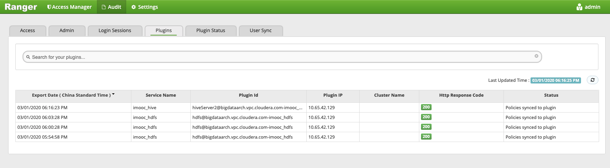
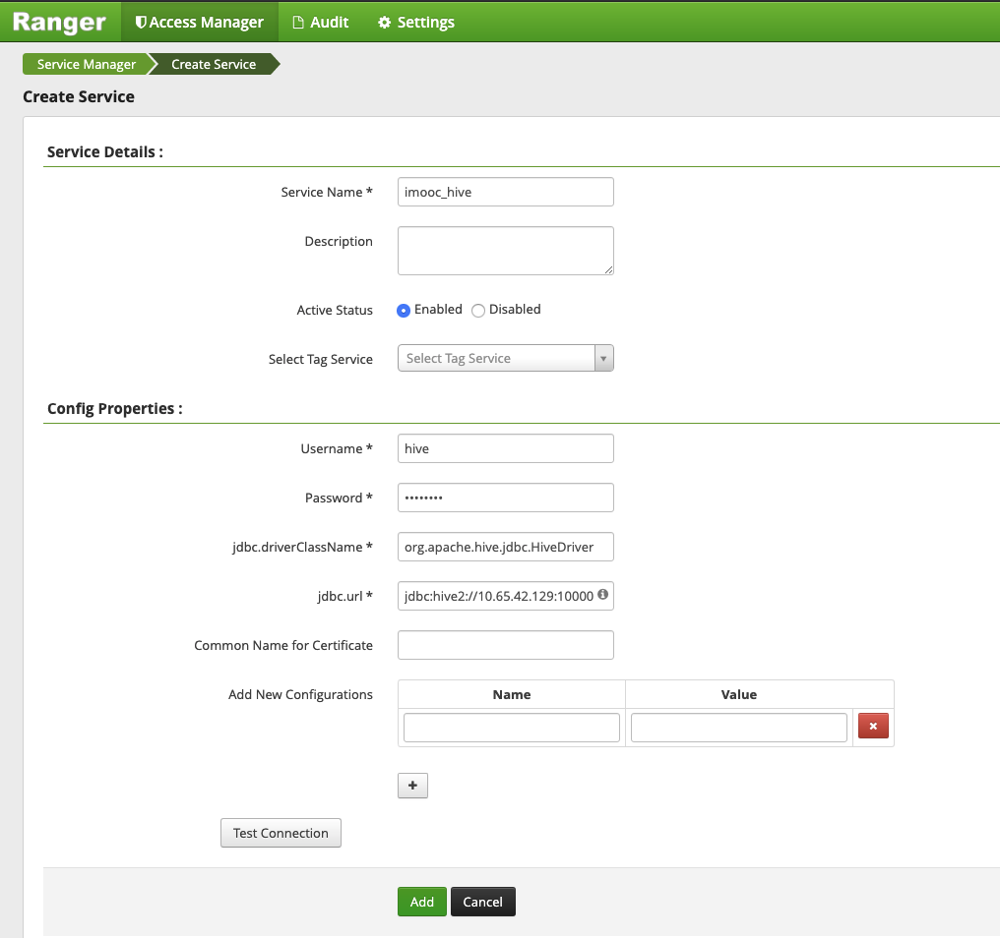

# BigdataPlatform

## Install Apache Ranger

Download from the official website:
    wget https://downloads.apache.org/ranger/1.2.0/apache-ranger-1.2.0.tar.gz

tar zxvf apache-ranger-1.2.0.tar.gz
cd apache-ranger-1.2.0
mvn -DskipTests=true clean compile package install assembly:assembly

ls /target

scp ranger-1.2.0-admin.tar.gz root@10.65.42.129:/root/
scp ranger-1.2.0-hdfs-plugin.tar.gz root@10.65.42.129:/root/
scp ranger-1.2.0-hive-plugin.tar.gz root@10.65.42.129:/root/

tar -zxvf ranger-1.2.0-admin.tar.gz -C /soft/home/
cd /soft/home/ranger-1.2.0-admin/
vim install.properties
    
    # 指定Ranger使用的数据库类型，我们这里使用mysql
    DB_FLAVOR=MYSQL
    # 指定数据库driver的path
    SQL_CONNECTOR_JAR=/usr/share/java/mysql-connector-java-5.1.22-bin.jar
    # 指定数据库root用户链接信息
    db_root_user=root
    db_root_password=1qaz@WSX
    db_host=localhost
    # 指定Ranger数据库名称及用户信息
    db_name=ranger
    db_user=rangeradmin
    db_password=1qaz@WSX
    # 设置一下相关秘钥，后续登录会使用到
    rangerAdmin_password=1qaz@WSX
    rangerTagsync_password=1qaz@WSX
    rangerUsersync_password=1qaz@WSX
    keyadmin_password=1qaz@WSX
    # 审计日志配置成数据库
    audit_store=db
    audit_db_user=root
    audit_db_name=ranger
    audit_db_password=1qaz@WSX
    
cp /home/hadoop/mysql-connector-java-5.1.44-bin.jar /usr/share/java/mysql-connector-java.jar

./setup.sh

ranger-admin start

## Install Ranger HFDS Plugin
解压缩安装包，并移动到指定目录
    tar zxvf ranger-1.2.0-hdfs-plugin.tar.gz
    mv ranger-1.2.0-hdfs-plugin /soft/
    
配置install.properties

    # Ranger Admin地址
    POLICY_MGR_URL=http://10.65.42.129:6080
    # 服务名词 很重要，后面在ranger-admin添加时需要保持一致
    REPOSITORY_NAME=imooc_hdfs
    # 安装目录，指定hadoop home
    COMPONENT_INSTALL_DIR_NAME=/soft/home/hadoop-2.8.5
    # 用户和用户组，我的环境默认使用hadoop用户启动相关服务
    CUSTOM_USER=hadoop
    CUSTOM_GROUP=hadoop
    #其他功能不开启，保持默认即可
    
执行安装命令

./enable-hdfs-plugin.sh

## Install Ranger HIVE Plugin
解压缩安装包，并移动到指定目录
    tar zxvf ranger-1.2.0-hive-plugin.tar.gz
    mv ranger-1.2.0-hive-plugin /soft/
    
配置install.properties

    # Ranger Admin地址
    POLICY_MGR_URL=http://10.65.42.129:6080
    # 服务名词 很重要，后面在ranger-admin添加时需要保持一致
    REPOSITORY_NAME=imooc_hive
    # 安装目录，指定hive home
    COMPONENT_INSTALL_DIR_NAME=/soft/home/apache-hive-2.3.6-bin
    # 用户和用户组，我的环境默认使用hadoop用户启动相关服务
    CUSTOM_USER=hadoop
    CUSTOM_GROUP=hadoop
    #其他功能不开启，保持默认即可

执行安装命令
./enable-hive-plugin.sh

### Web UI

